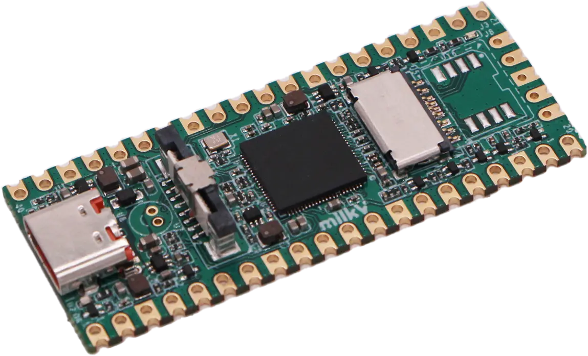

# seccam

**seccam** 是一款基于 [Milk-V Duo 256M](https://milkv.io/duo) 开发板的端侧智能安防系统。它在 RISC-V 开发板上完成摄像头采集、AI 推理、事件录像与 RTSP 推流，并具备浏览器管理控制台。整个系统仅需一张烧录好的 SD 卡即可运行，无需依赖云端服务。



## 能做什么

- **实时视频预览** — 通过 RTSP 播放开发板摄像头的 H.264 码流
- **实时人体检测** — 板载 TPU 推理，能够做到实时人体检测
- **事件触发录像** — 检测到目标时自动录像，抓拍目标从出现到离开的全部过程
- **管理控制台** — REST 接口查询状态、事件、录像列表；WebSocket 实时推送运行数据
- **一键烧录** — Docker 构建完整 SD 卡镜像，烧录到卡上开机即用

## 架构总览

```text
浏览器
  │
  ├── HTTP / WebSocket ────────── seccam-api (Rust)
  │                                  │
  └── RTSP ──────────────────────────┤
                                     │ Unix Domain Socket (JSON 帧协议)
                                     ▼
                               seccam-core (C++)
                                     │
                                     ├── VI / ISP / VPSS / VENC — 摄像头采集与编码
                                     ├── TDL 推理               — AI 目标检测
                                     ├── RTSP 推流              — H.264 实时流
                                     └── 事件录像               — 预缓冲 → 分段 H.264 文件
```

## 部署形态

### 对外端口

```text
HTTP:       http://<board-ip>:8080
WebSocket:  ws://<board-ip>:8080/ws/status
RTSP:       rtsp://<board-ip>/h264
```

## 快速开始

### 准备主机环境

```bash
sudo apt-get update
sudo apt-get install -y \
  git build-essential cmake make pkg-config \
  wget curl unzip xz-utils file \
  rsync docker.io
```

### 构建 SD 卡镜像

一条命令生成可烧录镜像：

```bash
docker build -f docker/board-image-builder.Dockerfile -t seccam-board-builder docker
docker run --rm --privileged \
  -v "$PWD:/workspace" \
  -w /workspace \
  seccam-board-builder \
  ./scripts/build_board_image.sh
```

产物：

```text
out/seccam-milkv-duo256m-musl-riscv64-sd-v2.0.1.img
out/seccam-milkv-duo256m-musl-riscv64-sd-v2.0.1.img.zip
out/seccam-milkv-duo256m-musl-riscv64-sd-v2.0.1.img.zip.sha256
```

将 `.img` 写入 SD 卡，插入开发板通电即可。系统启动后 `auto.sh` 自动拉起两个进程。

### 单独编译二进制（开发调试）

先拉取交叉编译依赖：

```bash
./scripts/prepare_duo256m_sdk.sh
```

首次编译 `seccam-core` 前，需先跑一次 `build_board_image.sh` 以从官方镜像提取 CVI 运行库到 `build/runtime/official-v2`。之后可以单独构建：

```bash
# 交叉编译 seccam-core (C++)
./scripts/build_core_riscv64.sh

# 交叉编译 seccam-api (Rust)
./scripts/build_api_riscv64.sh
```

产物：

```text
build/duo-riscv64-release/core/seccam-core
backend/target/riscv64gc-unknown-linux-musl/release/seccam-api
```

## 配置参数

`PATCH /api/v1/settings` 支持以下字段（均为可选）：

| 参数 | 类型 | 默认值 | 说明 |
|------|------|--------|------|
| `threshold` | float | 0.5 | 检测置信度阈值 |
| `trigger_hits` | u32 | 3 | 触发录像所需连续命中帧数 |
| `clear_misses` | u32 | 2 | 目标消失需连续未命中帧数 |
| `hold_seconds` | u32 | 10 | 目标消失后录像延续秒数 |
| `min_record_seconds` | u32 | 5 | 单次录像最短时长 |
| `stream_width` | u32 | 1280 | 推流宽度 |
| `stream_height` | u32 | 720 | 推流高度 |
| `detect_width` | u32 | 640 | 推理输入宽度 |
| `detect_height` | u32 | 384 | 推理输入高度 |
| `bitrate_kbps` | u32 | 2048 | H.264 编码码率 |
| `rtsp_port` | u32 | 554 | RTSP 服务端口 |
| `max_record_bytes` | u64 | 1 GiB | 录像目录总容量上限 |
| `max_segment_bytes` | u64 | 64 MiB | 单个录像文件大小上限 |
| `prebuffer_bytes` | u64 | 4 MiB | 预缓冲大小 |
| `model_name` | string | — | 模型名称 |
| `model_path` | string | — | 模型文件路径 |
| `record_dir` | string | — | 录像存储目录 |
| `sensor_config_path` | string | — | 传感器配置文件路径 |
| `rtsp_stream_name` | string | — | RTSP 流名称 |
| `draw_text` | bool | true | 是否在画面上叠加检测文本 |
| `person_class_id` | i32 | -1 | 人体类别 ID（模型相关） |

## 录像说明

录像文件保存为原始 **H.264 Annex B** 码流。检测到目标出现时，`seccam-core` 将预缓冲内容与当前编码帧一同写入录像文件；目标消失并超过 `hold_seconds` 后停止写入。录像目录按 `max_record_bytes` 做总量裁剪，超出时删除最早的文件。

## 模型

支持的模型文件为 `.cvimodel` 格式（CVI TDL SDK 专用）。仓库 `assets/models/` 中预置了：

- `pet_det_640x384.cvimodel` — 宠物检测
- `yolov3.cvimodel` — YOLOv3 通用目标检测

构建镜像时可通过环境变量指定模型：

```bash
docker run --rm --privileged \
  -v "$PWD:/workspace" -w /workspace \
  -e SECCAM_MODEL_SOURCE=/workspace/assets/models/yolov3.cvimodel \
  -e SECCAM_MODEL_NAME=yolov3 \
  seccam-board-builder \
  ./scripts/build_board_image.sh
```

## 许可

MIT License
